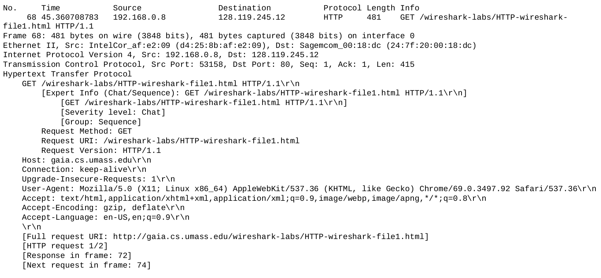
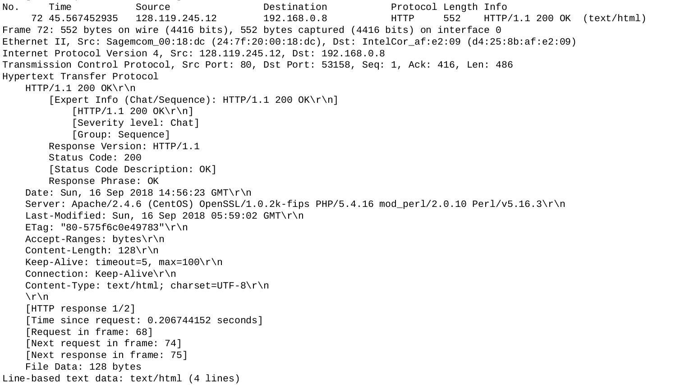

# COMPUTER NETWORKS AND THE INTERNET (ITCOM5 - FALL 2018)
## Wireshark lab 2.1
### 1. The Basic HTTP GET/response interaction
Output to exercises 1-7

Request:

Response:

#### 1. Is your browser running HTTP version 1.0 or 1.1? What version of HTTP is the server running?
*GET /wireshark-labs/HTTP-wireshark-file1.html **HTTP/1.1*** - my browser is running HTTP 1.1
***HTTP/1.1** 200 OK* - server is also runnign HTTP 1.1
#### 2. What languages (if any) does your browser indicate that it can accept to the server?
*Accept-Language: **en-US,en;q=0.9***
* American English as preffered.
* Other types of English with quality factor of 90%.
#### 3. What is the IP address of your computer? Of the gaia.cs.umass.edu server?
Based on GET request:
* *Source: **192.168.0.8***
* *Destination (gaia.cs.umass.edu): **128.119.245.12***
#### 4. What is the status code returned from the server to your browser?
*HTTP/1.1 **200 OK***
#### 5. When was the HTML file that you are retrieving last modified at the server?
*Last-Modified: **Sun, 16 Sep 2018 05:59:02 GMT*** 
#### 6. How many bytes of content are being returned to your browser?
*Accept-Ranges: **bytes**, Content-Length: **128***

128 bytes of content was returned from the server (not the whole TCP payload, just HTML).
#### 7. By inspecting the raw data in the packet content window, do you see any headers within the data that are not displayed in the packet-listing window? If so, name one.
I did not find any additional headers in raw data.

### 

## Wireshark lab 2.2