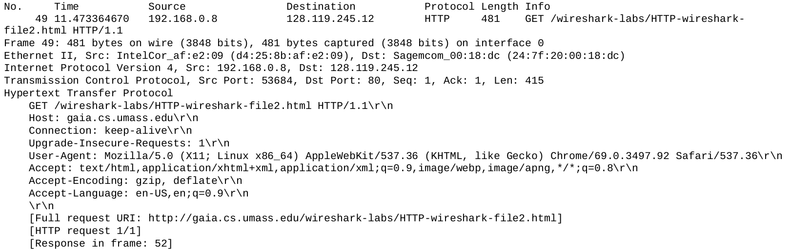
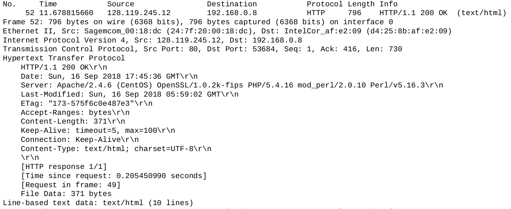
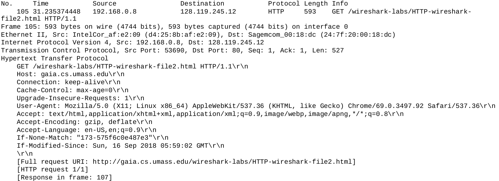
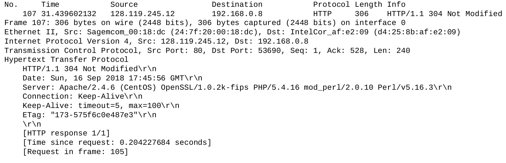

# COMPUTER NETWORKS AND THE INTERNET (ITCOM5 - FALL 2018)
## Wireshark lab 2.1
### 1. The Basic HTTP GET/response interaction
Output to exercises 1-7

Request:


Response:


#### 1. Is your browser running HTTP version 1.0 or 1.1? What version of HTTP is the server running?
*GET /wireshark-labs/HTTP-wireshark-file1.html **HTTP/1.1*** - my browser is running HTTP 1.1  
***HTTP/1.1** 200 OK* - server is also runnign HTTP 1.1
#### 2. What languages (if any) does your browser indicate that it can accept to the server?
*Accept-Language: **en-US,en;q=0.9***
* American English as preffered.
* Other types of English with quality factor of 90%.
#### 3. What is the IP address of your computer? Of the gaia.cs.umass.edu server?
Based on GET request:
* *Source: **192.168.0.8***
* *Destination (gaia.cs.umass.edu): **128.119.245.12***
#### 4. What is the status code returned from the server to your browser?
*HTTP/1.1 **200 OK***
#### 5. When was the HTML file that you are retrieving last modified at the server?
*Last-Modified: **Sun, 16 Sep 2018 05:59:02 GMT*** 
#### 6. How many bytes of content are being returned to your browser?
*Accept-Ranges: **bytes**, Content-Length: **128***  
128 bytes of content was returned from the server (not the whole TCP payload, just HTML).
#### 7. By inspecting the raw data in the packet content window, do you see any headers within the data that are not displayed in the packet-listing window? If so, name one.
I did not find any additional headers in raw data.

### 2. The HTTP CONDITIONAL GET/response interaction
Output for exercises 8-11  





#### 8. Inspect the contents of the first HTTP GET request from your browser to the server. Do you see an “IF-MODIFIED-SINCE” line in the HTTP GET?
No, the first HTTP GET request does not have “IF-MODIFIED-SINCE” header.
#### 9. Inspect the contents of the server response. Did the server explicitly return the contents of the file? How can you tell?
Yes, server explicitly returned requested resource judging by the HTTP Status Code 200 OK being returned in the response.  
*HTTP/1.1 **200 OK***  
Also, the response has *Content-Length* and *Accept-Ranges* headers, which indicates that file data was included to the response.  
***Accept-Ranges: bytes***, ***Content-Length: 371***  
Finally, the response has *Last-Modified* header which will be used to check if catched file version is old and should be re-downloaded.  
***Last-Modified: Sun, 16 Sep 2018 05:59:02 GMT***
#### 10. Now inspect the contents of the second HTTP GET request from your browser to the server. Do you see an “IF-MODIFIED-SINCE:” line in the HTTP GET? If so, what information follows the “IF-MODIFIED-SINCE” header?
Yes, second request has “IF-MODIFIED-SINCE” header:  
*If-Modified-Since: Sun, 16 Sep 2018 05:59:02 GMT*  
This header is used to see if file in catche is up-to-date. If so, the new version will be fetched from the server.
#### 11. What is the HTTP status code and phrase returned from the server in response to this second HTTP GET? Did the server explicitly return the contents of the file? Explain.
In the response to the first call, the resource was fetched explicitly from the server and we received:  
*Last-Modified: Sun, 16 Sep 2018 05:59:02 GMT*  
In further request for the same resource we added:  
*If-Modified-Since: **Sun, 16 Sep 2018 05:59:02 GMT***  
This date was compared with *Last-Modified* date on the server side.  
Because these two dates happened to be the same, server let catche know that catched file is valid and does not need to be re-downloaded.
We know that from HTTP Status Code in the second response:  
*HTTP/1.1 **304 Not Modified***  
Instead of fetching the same resource again from the server, catche was utilized to reuse once downloaded file, making sure it is up-to-date.

### 3. Retrieving Long Documents
Output for exercises 12-15
```
GET /wireshark-labs/HTTP-wireshark-file3.html HTTP/1.1
Host: gaia.cs.umass.edu
Connection: keep-alive
Upgrade-Insecure-Requests: 1
User-Agent: Mozilla/5.0 (X11; Linux x86_64) AppleWebKit/537.36 (KHTML, like Gecko) Chrome/69.0.3497.92 Safari/537.36
Accept: text/html,application/xhtml+xml,application/xml;q=0.9,image/webp,image/apng,*/*;q=0.8
Accept-Encoding: gzip, deflate
Accept-Language: en-US,en;q=0.9

HTTP/1.1 200 OK
Date: Sun, 16 Sep 2018 18:33:47 GMT
Server: Apache/2.4.6 (CentOS) OpenSSL/1.0.2k-fips PHP/5.4.16 mod_perl/2.0.10 Perl/v5.16.3
Last-Modified: Sun, 16 Sep 2018 05:59:02 GMT
ETag: "1194-575f6c0e42252"
Accept-Ranges: bytes
Content-Length: 4500
Keep-Alive: timeout=5, max=100
Connection: Keep-Alive
Content-Type: text/html; charset=UTF-8
```
#### 12. How many HTTP GET request messages did your browser send? Which packet number in the trace contains the GET message for the Bill or Rights?
#### 13. Which packet number in the trace contains the status code and phrase associated with the response to the HTTP GET request?
#### 14. What is the status code and phrase in the response?
#### 15. How many data-containing TCP segments were needed to carry the single HTTP response and the text of the Bill of Rights?


## Wireshark lab 2.2