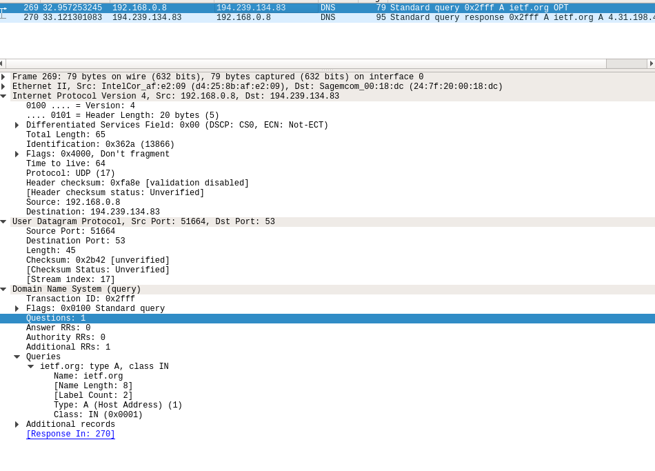
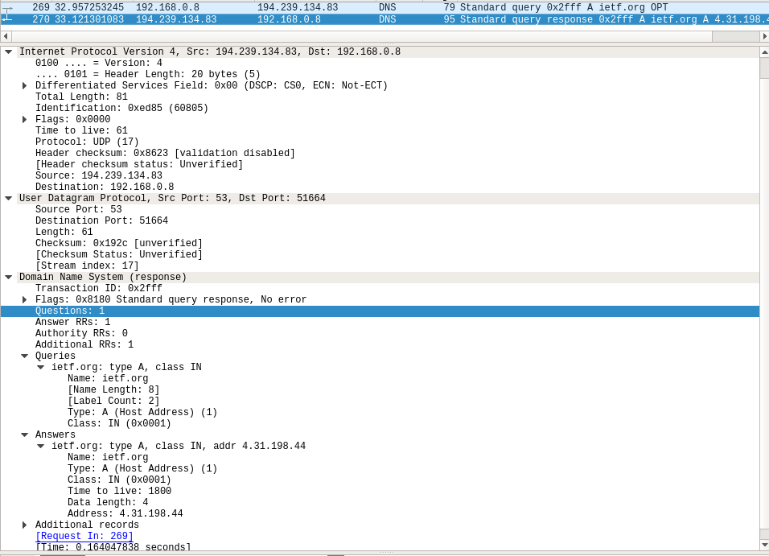
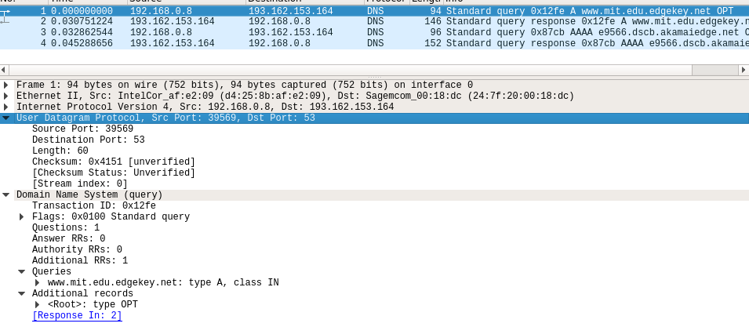
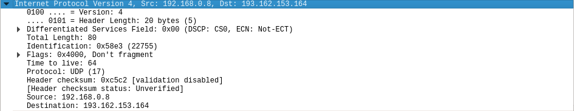
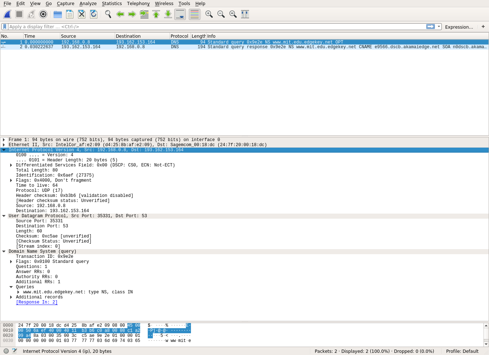

# COMPUTER NETWORKS AND THE INTERNET (ITCOM5 - FALL 2018) - Wireshark lab 2.2
## 1. *nslookup*
### 1. Run nslookup to obtain the IP address of a Web server in Asia. What is the IP address of that server?
```bash
$ nslookup www.kaist.edu
Server:		127.0.0.53
Address:	127.0.0.53#53

Non-authoritative answer:
Name:	www.kaist.edu
**Address: 143.248.5.153**
```
### 2. Run nslookup to determine the authoritative DNS servers for a university in Europe.
### 3. Run nslookup so that one of the DNS servers obtained in Question 2 is queried for the mail servers for Yahoo! mail. What is its IP address?

## 2. *ifconfig*
Note! Ubuntu has local DNS caching turned off by default. To use it, install and configure *dnsmasq* package.

## 3. Tracing DNS with Wireshark
Obtaining IP from wlp2s0 - my PCs default Wi-FI interface:  
```bash
$ ifconfig wlp2s0
wlp2s0: flags=4163<UP,BROADCAST,RUNNING,MULTICAST>  mtu 1500
        **inet 192.168.0.8**  netmask 255.255.255.0  broadcast 192.168.0.255
        inet6 fe80::7110:6fed:74aa:9ada  prefixlen 64  scopeid 0x20<link>
        ether d4:25:8b:af:e2:09  txqueuelen 1000  (Ethernet)
        RX packets 366278  bytes 307260224 (307.2 MB)
        RX errors 0  dropped 0  overruns 0  frame 0
        TX packets 92979  bytes 18643960 (18.6 MB)
        TX errors 0  dropped 0 overruns 0  carrier 0  collisions 0

```
### 4. Locate the DNS query and response messages. Are then sent over UDP or TCP?
They are sent over UDP.    


### 5. What is the destination port for the DNS query message? What is the source port of DNS response message?
*User Datagram Protocol, **Src Port: 51664, Dst Port: 53***  
My machine port: 51664  
DNS server port: 53
### 6. To what IP address is the DNS query message sent? Use ipconfig to determine the IP address of your local DNS server. Are these two IP addresses the same?
My local DNS address:  
```bash
$ nano /etc/resolv.conf
...
nameserver 127.0.0.53
**search webspeed.dk** <-- my DNS server

$ nslookup webspeed.dk
Server:		127.0.0.53
Address:	127.0.0.53#53

Non-authoritative answer:
Name:	webspeed.dk
**Address: 193.88.185.62**
```
Hence, my local DNS IP address is **193.88.185.62**  
Destination IP of DNS query (taken from IPv4 dropdown window): *Destination: *194.239.134.83**  
These IPs are not the same, which I think means that I queried different DNS server?
### 7. Examine the DNS query message. What “Type” of DNS query is it? Does the query message contain any “answers”?
***ietf.org: type A, class IN*** - It is A TYPE query, which will return a following Record Resource:
(hostname, IP address, A, Time-To-Live)  
The query message does not contain any answers, it only specifies questions (and specifies in which format it expects the answer).
### 8. Examine the DNS response message. How many “answers” are provided? What do each of these answers contain?
As expected, in answers we got:  
```
ietf.org: type A, class IN, addr 4.31.198.44
Name: ietf.org -> hostname
Type: A (Host Address) (1) -> type
Time to live: 1800 -> TTL
Address: 4.31.198.44 -> host IP address
```

### 9. Consider the subsequent TCP SYN packet sent by your host. Does the destination IP address of the SYN packet correspond to any of the IP addresses provided in the DNS response message?
Yes, after retrieving IP address to *ietf.org*, which was *4.31.198.44*, my browser sent a couple of HTTP GET requests to it and begun TCP stream:
```
GET / HTTP/1.1
Host: ietf.org
Connection: keep-alive
Upgrade-Insecure-Requests: 1
User-Agent: Mozilla/5.0 (X11; Linux x86_64) AppleWebKit/537.36 (KHTML, like Gecko) Chrome/69.0.3497.92 Safari/537.36
Accept: text/html,application/xhtml+xml,application/xml;q=0.9,image/webp,image/apng,*/*;q=0.8
Accept-Encoding: gzip, deflate
Accept-Language: en-US,en;q=0.9

HTTP/1.1 200 OK
Date: Sat, 29 Sep 2018 15:09:15 GMT
Server: Apache
Vary: Cookie,Accept-Encoding
X-Frame-Options: SAMEORIGIN
Content-Encoding: gzip
Strict-Transport-Security: max-age=31536000
X-Frame-Options: SAMEORIGIN
X-Xss-Protection: 1; mode=block
X-Content-Type-Options: nosniff
Keep-Alive: timeout=15, max=100
Connection: Keep-Alive
Transfer-Encoding: chunked
Content-Type: text/html; charset=utf-8

...

1faa
............i{...0...~......I.v......N.6..;MR................k.#.JJ{.{.i-..{..^...?.v~..6)n:...h8x..u.y.y2.~!......u...q.............e.....t.de.....w....<y.o6iv..w.F...
..i6X........fs..OD..^.E'..H..f...N%.(...97...".o.IV.2....UBi+....[x.L.....D..XF.7..E.....*..........J..X.S.-...Kq...U..*`...^....U...7IQ...h9..kq..#).j[d.,..\...T.V.E..^\E..^.6.'.....`...z.2M^........O.................t.....>.~6..v... ....U.../..W.?.z'........|H.....g......?......xr...<=>.....Kjm&...i9{.)..c........8....g..S..wzzz|...j..NO.q........}..~.......8.f..]Ul..2^.....V.>OI.............o...Om.6./...}
*X..7.^..2.a......~<......}.M.*..b..Vy.......DH.

...


```
### 10. This web page contains images. Before retrieving each image, does your host issue new DNS queries?
No, my host does not issue new DNS queries as the TCP connection was already established.  
However, there were some re-queries for the same host from time to time.    
### 11. What is the destination port for the DNS query message? What is the source port of DNS response message?
  
**(my PC) Source Port: 39569, (DNS response message source) Destination Port: 53**
### 12. To what IP address is the DNS query message sent? Is this the IP address of your default local DNS server?
  
Based on DNS query message:  
**Internet Protocol Version 4, Src: 192.168.0.8 (my PC), Dst: 193.162.153.164 (DNS server)**  
### 13. Examine the DNS query message. What “Type” of DNS query is it? Does the query message contain any “answers”?
Same as in previous task 7.  
### 14. Examine the DNS response message. How many “answers” are provided? What do each of these answers contain?
Same as in previous task 8.  
### 15. Provide a screenshot.
Included above.  
### 16. To what IP address is the DNS query message sent? Is this the IP address of your default local DNS server?
  
```bash
$ nslookup webspeed.dk
Server:		127.0.0.53
Address:	127.0.0.53#53

Non-authoritative answer:
Name:	webspeed.dk
**Address: 193.88.185.62**
```
My local DNS address: 193.88.185.62  
DNS query destination address: Destination: 193.162.153.164  
It is different IP address from my local DNS.  
### 17. Examine the DNS query message. What “Type” of DNS query is it? Does the query message contain any “answers”?
It is query of type NS: *www.mit.edu.edgekey.net: **type NS**, class IN*  
I expect to receive following answer: (domain, hostname of authoritative DNS server, NS)  
This allows me to get IP of DNS server that serves hosts in specified domain, in this case **www.mit.edu.edgekey.net**.    
### 18. Examine the DNS response message. What MIT nameservers does the response message provide? Does this response message also provide the IP addresses of the MIT namesers?
*www.mit.edu.edgekey.net: type CNAME, class IN, cname e9566.dscb.akamaiedge.net*  
My DNS served me CNAME type answer for NS type query. I received canonical hostname for **www.mit.edu.edgekey.net**, which is  **e9566.dscb.akamaiedge.net**  
### 19. Provide a screenshot.
Include above.

### Command to questions 20-23 times out on Linux Ubuntu 18.04 
```bash
$ nslookup www.aiit.or.kr bitsy.mit.edu
;; connection timed out; no servers could be reached
```
### 20. To what IP address is the DNS query message sent? Is this the IP address of your default local DNS server? If not, what does the IP address correspond to?
### 21. Examine the DNS query message. What “Type” of DNS query is it? Does the query message contain any “answers”?
### 22. Examine the DNS response message. How many “answers” are provided? What does each of these answers contain?
### 23. Provide a screenshot.

