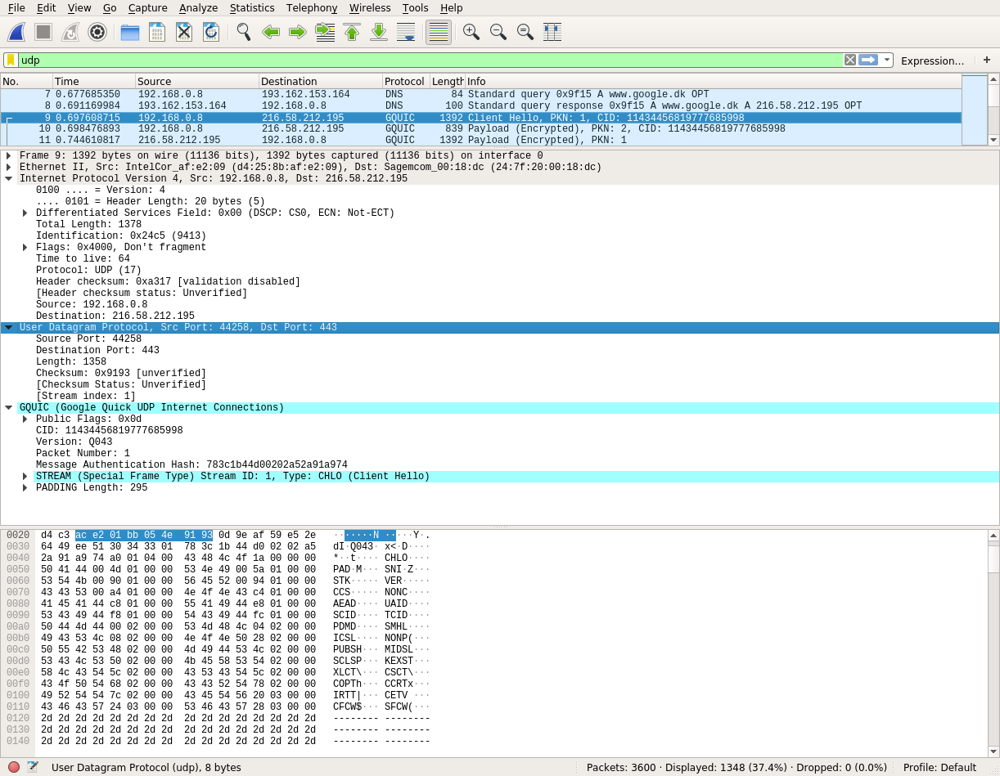
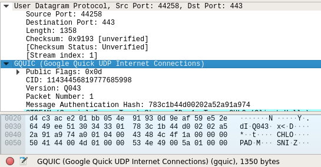
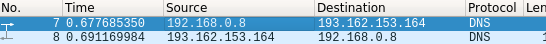

# Wireshark lab 3.1
#### 1. Select one UDP packet from your trace. From this packet, determine how many fields there are in the UDP header. (You shouldn’t look in the textbook! Answer these questions directly from what you observe in the packet trace.) Name these fields.  
* Screenshot of captured packet  
 

4 fields: *Source Port*, *Destination Port*, *Length*, *Checksum*  
#### 2. By consulting the displayed information in Wireshark’s packet content field for this packet, determine the length (in bytes) of each of the UDP header fields.  
Entire UDP header is 8 bytes - 2 bytes per field.     
#### 3. The value in the Length field is the length of what? (You can consult the text for this answer). Verify your claim with your captured UDP packet.   
Length header specifies size of UDP header and UDP payload in bytes.     
*Length: 1358* <-- total size of UDP part (header + data)    
GQUIC part of packet - UDP payload - has 1350 bytes. UDP header has 8 bytes.    
 
#### 4. What is the maximum number of bytes that can be included in a UDP payload? (Hint: the answer to this question can be determined by your answer to 2. above)  
The size of a UDP packet is stored in a two-byte field, which means the maximum size representable is (2^16 – 1) = 65535 bytes.  
RFC-8085:  
```
A UDP datagram is carried in a single IP packet and is hence limited
   to a maximum payload of 65,507 bytes for IPv4 and 65,527 bytes for
   IPv6.  The transmission of large IP packets usually requires IP
   fragmentation.
```

However, in practise the size goes up to 1400 bytes, but some routers can drop packets that are too fat.       
#### 5. What is the largest possible source port number? (Hint: see the hint in 4.)  
It is 65535.    
#### 6. What is the protocol number for UDP? Give your answer in both hexadecimal and decimal notation. To answer this question, you’ll need to look into the Protocol field of the IP datagram containing this UDP segment (see Figure 4.13 in the text, and the discussion of IP header fields).  
*Protocol: UDP (17)* - decimal: 17, hex: 0x11   
#### 7. Examine a pair of UDP packets in which your host sends the first UDP packet and the second UDP packet is a reply to this first UDP packet. (Hint: for a second packet to be sent in response to a first packet, the sender of the first packet should be the destination of the second packet). Describe the relationship between the port numbers in the two packets.
Source port of outgoing packet is the destination port of response packet, and vice versa.  
   