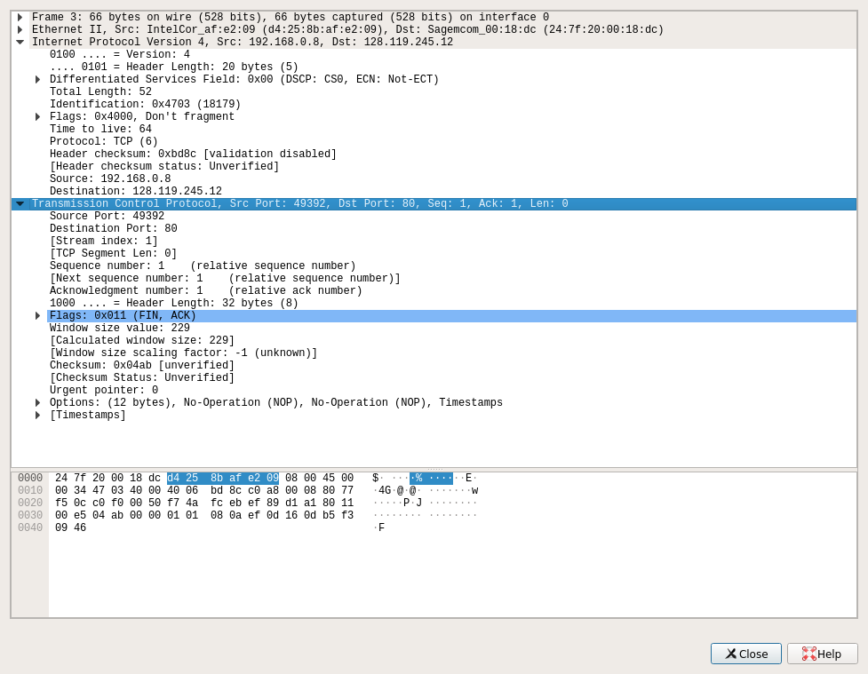

# Wireshark lab 3.2
#### 1. What is the IP address and TCP port number used by the client computer (source) that is transferring the file to gaia.cs.umass.edu? To answer this question, it’s probably easiest to select an HTTP message and explore the details of the TCP packet used to carry this HTTP message, using the “details of the selected packet header window” (refer to Figure 2 in the “Getting Started with Wireshark” Lab if you’re uncertain about the Wireshark windows.    
 
*Source: 192.168.0.8* 
*Source Port: 49392*    
#### 2. What is the IP address of gaia.cs.umass.edu? On what port number is it sending and receiving TCP segments for this connection?  
*Destination: 128.119.245.12*   
*Destination Port: 80*  

#### 3. What is the IP address and TCP port number used by your client computer (source) to transfer the file to gaia.cs.umass.edu?
Answered in 1.  

#### 4. What is the sequence number of the TCP SYN segment that is used to initiate the TCP connection between the client computer and gaia.cs.umass.edu What is it in the segment that identifies the segment as a SYN segment?
SYN segment has *Sequence number: 0*      
SYN segment also has no application data and a flag in which one of the bits is set to 1    
 
#### 5. What is the sequence number of the SYNACK segment sent by gaia.cs.umass.edu to the client computer in reply to the SYN? What is the value of the Acknowledgement field in the SYNACK segment? How did gaia.cs.umass.edu determine that value? What is it in the segment that identifies the segment as a SYNACK segment?
SYNACK segment has *Sequence number: 0*, and *Acknowledgment number: 1* . SYNACK also has no application data and a flag in which two of it's bits are set to 1 (Syn, Acknowledgement). ACK number is usually chosen randomly.

#### 6. What is the sequence number of the TCP segment containing the HTTP POST command? Note that in order to find the POST command, you’ll need to dig into the packet content field at the bottom of the Wireshark window, looking for a segment with a “POST” within its DATA field.

*Sequence number: 1*  
#### 7. Consider the TCP segment containing the HTTP POST as the first segment in the TCP connection. What are the sequence numbers of the first six segments in the TCP connection (including the segment containing the HTTP POST)? At what time was each segment sent? When was the ACK for each segment received? Given the difference between when each TCP segment was sent, and when its acknowledgement was received, what is the RTT value for each of the six segments? What is the EstimatedRTT value (see Section 3.5.3, page 242 in text) after the receipt of each ACK? Assume that the value of the EstimatedRTT is equal to the measured RTT for the first segment, and then is computed using the EstimatedRTT equation on page 242 for all subsequent segments.
Answered in 8.  
#### 8. What is the length of each of the first six TCP segments?
1. *Sequence number: 1*    , *[TCP Segment Len: 650]*  , *[Sending time: 0.121687928 seconds]* , *[Acked: 0.327545392 seconds]*, *[RTT: 0.205857464 seconds]*
2. *Sequence number: 651*  , *[TCP Segment Len: 1448]* , *[Sending time: 0.121731847 seconds]* , 
3. *Sequence number: 2099* , *[TCP Segment Len: 1448]* , *[Sending time: 0.121734986 seconds]* , 
4. *Sequence number: 3547* , *[TCP Segment Len: 1448]* , *[Sending time: 0.121740475 seconds]* , 
5. *Sequence number: 4995* , *[TCP Segment Len: 1448]* , *[Sending time: 0.121741658 seconds]* , 
6. *Sequence number: 6443* , *[TCP Segment Len: 1448]* , *[Sending time: 0.122181741 seconds]* , 

I could not find ACKs for the remaining segments.
#### 9. What is the minimum amount of available buffer space advertised at the received for the entire trace? Does the lack of receiver buffer space ever throttle the sender?
*Window size value: 229* <-- amount of available buffer space at the sender-side (advertised in TCP segments).  
Yes, it happens once later in the trace (I think so).   

#### 10. Are there any retransmitted segments in the trace file? What did you check for (in the trace) in order to answer this question?
Yes, there are - there was much more segments sent that acknowledged (not sure about this one).  
#### 11. How much data does the receiver typically acknowledge in an ACK? Can you identify cases where the receiver is ACKing every other received segment (see Table 3.2 on page 250 in the text).
Yes, it happens all the time in my trace. 

It is because typically, receiver sends ACK when Window Size is reached to allow for faster TCP transfer (receiver does not wait for every segment to be acknowledged). But the Window Size is a size of a buffer receiving data.  
SYNACK segment advertised the amount of bytes sender is allowed to send before receiving acknowledgement.  
*Window size value: 28960*  
#### 12. What is the throughput (bytes transferred per unit time) for the TCP connection? Explain how you calculated this value.

#### 13. Use the Time-Sequence-Graph(Stevens) plotting tool to view the sequence number versus time plot of segments being sent from the client to the gaia.cs.umass.edu server. Can you identify where TCP’s slowstart phase begins and ends, and where congestion avoidance takes over? Comment on ways in which the measured data differs from the idealized behavior of TCP that we’ve studied in the text.
   

* Slowstart phase:  
  
#### 14. Answer each of two questions above for the trace that you have gathered when you transferred a file from your computer to gaia.cs.umass.edu