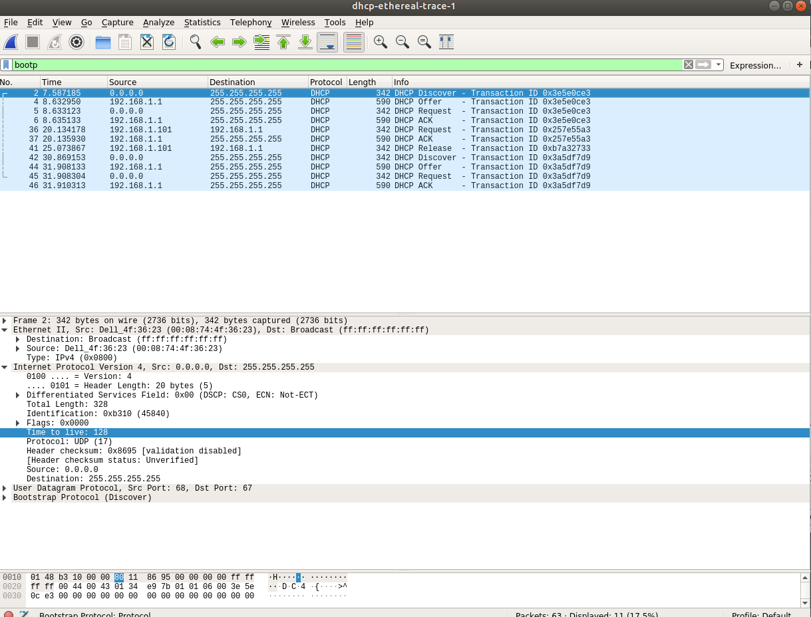
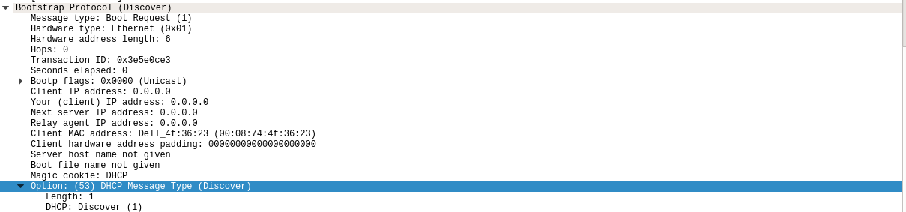
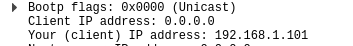
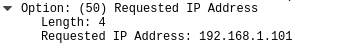
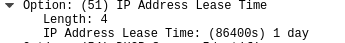

# Wireshark lab 3.2
#### 1. Are DHCP messages sent over UDP or TCP?
  
Over UPD.

#### 2. Draw a timing datagram illustrating the sequence of the first four-packet Discover/Offer/Request/ACK DHCP exchange between the client and server. For each packet, indicated the source and destination port numbers. Are the port numbers the same as in the example given in this lab assignment?
  
Yes, they are the same.    

#### 3. What is the link-layer (e.g., Ethernet) address of your host?
**Source: Dell_4f:35:23 (00:08:70:4f:35:23)**  
#### 4. What values in the DHCP discover message differentiate this message from the DHCP request message?
  
Values in Option 53 of Bootstrap Protocol differantiate DHCP message types.  

#### 5. What is the value of the Transaction-ID in each of the first four (Discover/Offer/Request/ACK) DHCP messages? What are the values of the Transaction-ID in the second set (Request/ACK) set of DHCP messages? What is the purpose of the Transaction-ID field?
**Transaction ID: 0x3e5e0ce3 - same for first four messages**
**Transaction ID: 0x257e55a3 - same for following two messages**
Transaction ID is a random number chosen by the client, and used by the client and server to associate messages and responses between a client and a server.  

#### 6. A host uses DHCP to obtain an IP address, among other things. But a host’s IP address is not confirmed until the end of the four-message exchange! If the IP address is not set until the end of the four-message exchange, then what values are used in the IP datagrams in the four-message exchange? For each of the four DHCP messages (Discover/Offer/Request/ACK DHCP), indicate the source and destination IP addresses that are carried in the encapsulating IP datagram.
msgType: source/destination  
Discover: 0.0.0.0/255.255.255.255  
Offer: 192.168.1.1/255.255.255.255  
Request: 0.0.0.0/255.255.255.255  
ACK:192.168.1.1/255.255.255.255  
0.0.0.0 is a default address (DHCP client), while 255.255.255.255 is a Limited Broadcasting Address over LAN. 
#### 7. What is the IP address of your DHCP server?
192.168.1.1 is then a DHCP server address.  
#### 8. What IP address is the DHCP server offering to your host in the DHCP Offer message? Indicate which DHCP message contains the offered DHCP address.
  
DHCP address is offered in Offer message:  
    
#### 9. In the example screenshot in this assignment, there is no relay agent between the host and the DHCP server. What values in the trace indicate the absence of a relay agent? Is there a relay agent in your experiment? If so what is the IP address of the agent?
Source address of 0.0.0.0 indicates that there is no relay agent in this DHCP exchange. Likewise, there is no relay agent in my experiment, as my messages come from 0.0.0.0 source address.  
#### 10. Explain the purpose of the router and subnet mask lines in the DHCP offer message.
Option 1 Subnet Mask tells the client which Netmask it should use, while Option 3 Router specifies destination address of further messages.  
#### 11. In the DHCP trace file noted in footnote 2, the DHCP server offers a specific IP address to the client (see also question 8. above). In the client’s response to the first server OFFER message, does the client accept this IP address? Where in the client’s RESPONSE is the client’s requested address?
Client accepts the IP address in REQUEST message. 
  
#### 12. Explain the purpose of the lease time. How long is the lease time in your experiment?
Lease is a period over which a network address is allocated to a client. My lease time:  
  
#### 13. What is the purpose of the DHCP release message? Does the DHCP server issue an acknowledgment of receipt of the client’s DHCP request? What would happen if the client’s DHCP release message is lost?
Client may choose to relinquish its lease on the network address by sending DHCP RELEASE message. If the release message is lost, then the sever will retain the ip address until the lease time expires or the client issues a new address.
#### 14. Clear the bootp filter from your Wireshark window. Were any ARP packets sent or received during the DHCP packet-exchange period? If so, explain the purpose of those ARP packets.
ARP protocol maps physical MAC addresses of machines (link layer) to IP addresses (network layer).   