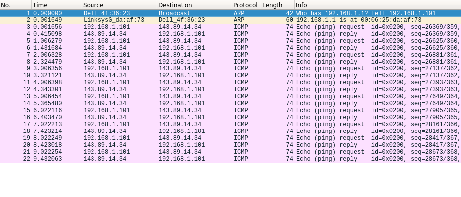

  
#### 1. What is the IP address of your host? What is the IP address of the destination host?
Host address: 192.168.1.101  
Destination address: 143.89.14.34  
#### 2. Why is it that an ICMP packet does not have source and destination port numbers?
Because ICMP messeges are encapsulated in the IP packets.  
#### 3. Examine one of the ping request packets sent by your host. What are the ICMP type and code numbers? What other fields does this ICMP packet have? How many bytes are the checksum, sequence number and identifier fields?
Type 8 for outgoing and 0 for incoming packet. 0 code number for both. Other fields: Checksum, Identified (BE), Identifier (LE), Sequence number (BE), Sequence number (LE). Each has 2 bytes, which gives 10 bytes in total.  
#### 4. Examine the corresponding ping reply packet. What are the ICMP type and code numbers? What other fields does this ICMP packet have? How many bytes are the checksum, sequence number and identifier fields?
Different fields: Type (0), Checksum (makes sense as type changed).  
#### 5. What is the IP address of your host? What is the IP address of the target destination host?
Source: 192.168.1.101, Destination: 143.89.14.34  
#### 6. If ICMP sent UDP packets instead (as in Unix/Linux), would the IP protocol number still be 01 for the probe packets? If not, what would it be?
No, IP protocol packet for UDP would be 17.  
#### 7. Examine the ICMP echo packet in your screenshot. Is this different from the ICMP ping query packets in the first half of this lab? If yes, how so?
No, ICMP ping packet has the same fields.  
#### 8. Examine the ICMP error packet in your screenshot. It has more fields than the ICMP echo packet. What is included in those fields?
In addition to ICMP header, error packet containts whole IP header of failed packet and first 8 bytes of it's payload.  
#### 9. Examine the last three ICMP packets received by the source host. How are these packets different from the ICMP error packets? Why are they different?
They are a regular ICMP response packets of type 0. There was no TTL expiration.  
#### 10. Within the tracert measurements, is there a link whose delay is significantly longer than others? Refer to the screenshot in Figure 4, is there a link whose delay is significantly longer than others? On the basis of the router names, can you guess the location of the two routers on the end of this link?
On the Figure 4, there is a significant increase of rt between steps 9 (25ms) and 10 (98ms). Router names suggest that it's a hop between New York City in USA and La Pastourelle in France.  