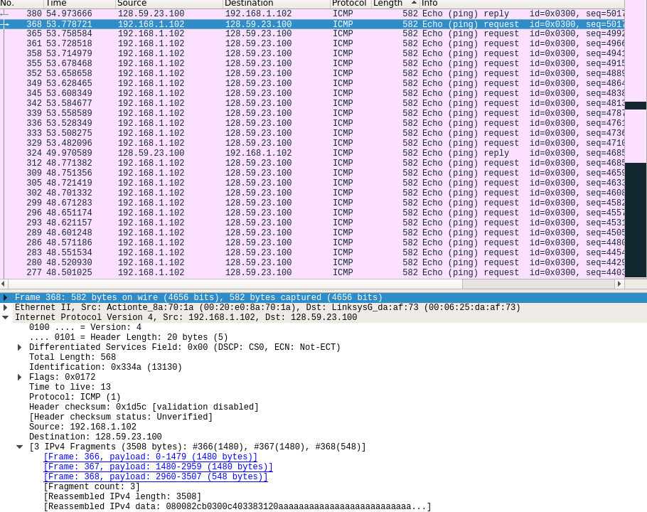

#### 1. Select the first ICMP Echo Request message sent by your computer, and expand the Internet Protocol part of the packet in the packet details window.  What is the IP address of your computer?
192.168.1.102
#### 2. Within the IP packet header, what is the value in the upper layer protocol field?
**Protocol: ICMP (1)**
#### 3. How many bytes are in the IP header? How many bytes are in the payload of the IP datagram? Explain how you determined the number of payload bytes.
IP Header is 20 bytes. Total Length of packet is 84 bytes. This info is in IP Header. Then, IP payload is 64 bytes long.  
#### 4. Has this IP datagram been fragmented? Explain how you determined whether or not the datagram has been fragmented.
There is no Fragmentation Offset header, so there was no Fragmentation.    
#### 5. Which fields in the IP datagram always change from one datagram to the next within this series of ICMP messages sent by your computer?
Identification, TTL and Checksum.  
#### 6. Which fields stay constant? Which of the fields must stay constant? Which fields must change? Why?
Same fields: Version (IPv4), Protocol (ICMP).
Different fields: Total length, TTL, Checksum, Source, Destination, Differentiated Services Field, Identification. Checksum must always changes as the packet contents and header values change.   
#### 7. Describe the pattern you see in the values in the Identification field of the IP datagram.
Identification number increments by 1 with each message sent from host.  
#### 8. What is the value in the Identification field and the TTL field?
Identification is a unique value that is assigned to a packet coming from a sigle host. TTL is a Time-to-live of a packet, after which it will be dropped on routers.  
#### 9. Do these values remain unchanged for all of the ICMP TTL-exceeded replies sent to your computer by the nearest (first hop) router? Why?
TTL changes, while Identification takes up a number and then consecutive packets have a 0 identification (most likely, router detects same packets and only assigns new identification to new packets). Identification is then assigned again after some time.   
#### 10. Find the first ICMP Echo Request message that was sent by your computer after you changed the Packet Size in pingplotter to be 2000. Has that message been fragmented across more than one IP datagram? [Note: if you find your packet has not been fragmented, you should download the zip file http://gaia.cs.umass.edu/wireshark-labs/wireshark-traces.zip and extract the ipethereal-trace-1packet trace. If your computer has an Ethernet interface, a packet size of 2000 should cause fragmentation.3]
Yes. 
#### 11. Print out the first fragment of the fragmented IP datagram. What information in the IP header indicates that the datagram been fragmented? What information in the IP header indicates whether this is the first fragment versus a latter fragment?How long is this IP datagram?
  
A Fragmentation Offset flag.  
#### 12. Print out the second fragment of the fragmented IP datagram. What information in the IP header indicates that this is not the first datagram fragment? Are the more fragments? How can you tell?
Linux version of Wireshark does not display fragmented frames properly (can't diplay other fragments).     
#### 13. What fields change in the IP header between the first and second fragment?
Linux version of Wireshark does not display fragmented frames properly (can't diplay other fragments).  
#### 14. How many fragments were created from the original datagram?
Three  
#### 15. What fields change in the IP header among the fragments?
Linux version of Wireshark does not display fragmented frames properly (can't diplay other fragments).   